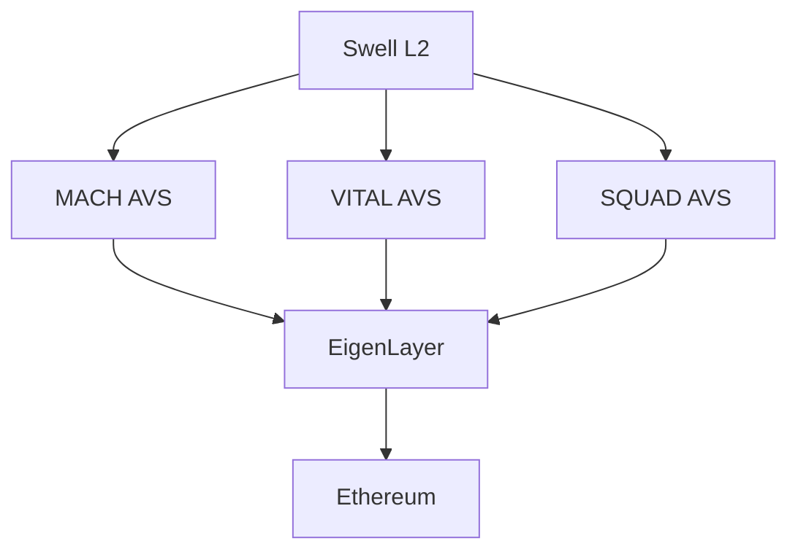

## Overview

Swell L2 operates as a restaking-powered Layer 2 network built on the OP Stack.
The network extends Ethereum's security through EigenLayer's restaking mechanism while leveraging Optimism's proven infrastructure for transaction processing and scalability.

## Technical Architecture

### Restaking Infrastructure

Swell L2 implements three vertically integrated AltLayer Actively Validated Services (AVSs) that work together to provide security and performance:



[MACH AVS](https://docs.altlayer.io/altlayer-documentation/restaked-rollups/mach-for-faster-finality)  provides fast finality and cross-rollup interoperability, completing transaction confirmation in under 10 seconds compared to Ethereum's ~13 minute finality. This enables efficient bridge operations and MEV mitigation.

[VITAL AVS](https://docs.altlayer.io/altlayer-documentation/restaked-rollups/vital-for-decentralised-verification)  handles state verification through fraud proofs or ZK proofs, providing L1-level security guarantees through permissionless verification nodes. The service maintains high availability while enabling community participation through staking.

[SQUAD AVS](https://docs.altlayer.io/altlayer-documentation/restaked-rollups/squad-for-decentralised-sequencing) decentralizes the sequencing layer by distributing transaction ordering across multiple nodes. This eliminates single points of failure and enables community participation through sequencer staking, while providing censorship resistance.

These services leverage EigenLayer's restaking mechanism to provide shared security across the network while maintaining decentralization and performance.

### Optimism Integration

The network operates as part of the Optimism Superchain, inheriting:

```solidity
interface IOptimismFeatures {
    // Shared security model
    function bridging() external;
    function governance() external;
    function upgrades() external;
    function communication() external;
}
```

## Network Specifications

### Performance Metrics

| Metric | Value |
|--------|--------|
| Block Time | ~2 seconds |
| Time to Finality | \<1 second |
| Gas Limit | 30,000,000 |
| Target Gas Price | 0.001 gwei |

### Security Model

Swell L2 implements a multi-layered security approach:

1. Base security from Ethereum through EigenLayer restaking
2. Additional validation through distributed AVS networks
3. Optimism's proven fraud-proof system
4. Decentralized sequencer network

## Economic Design

The network operates with a dual-token model:

```solidity
interface ITokenomics {
    // Native gas token
    function WETH() external returns (address);
    
    // Governance token
    function SWELL() external returns (address);
}
```

Transaction fees are split between:

- Restakers providing security
- AVS operators maintaining network services
- Protocol treasury for ongoing development

## Development Focus

Swell L2 prioritizes:

1. Scalable DeFi infrastructure
2. MEV-resistant transaction ordering
3. Cross-chain interoperability
4. Developer-friendly environment

## Network Status

View current network status at [status.swellnetwork.io](https://status.swellnetwork.io)

## Future Development

The development roadmap focuses on:

1. Expanding AVS integrations
2. Implementing advanced MEV protection
3. Enhancing cross-chain capabilities
4. Scaling validator participation

## Technical Resources

- [GitHub](https://github.com/swellnetwork)
- [Network Explorer](https://explorer.swellnetwork.io)
- [Developer Discord](https://discord.gg/swellnetwork)
